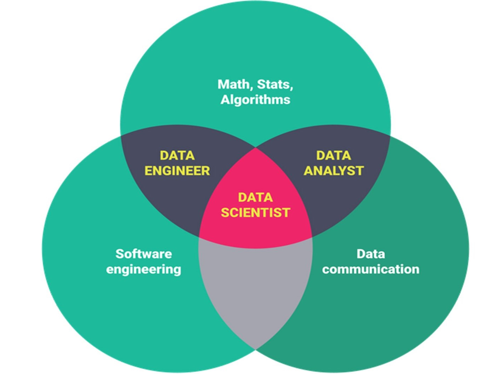
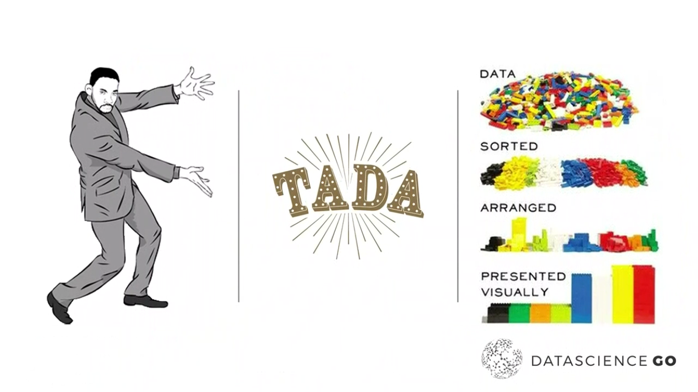
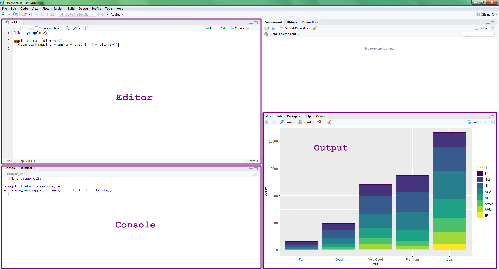
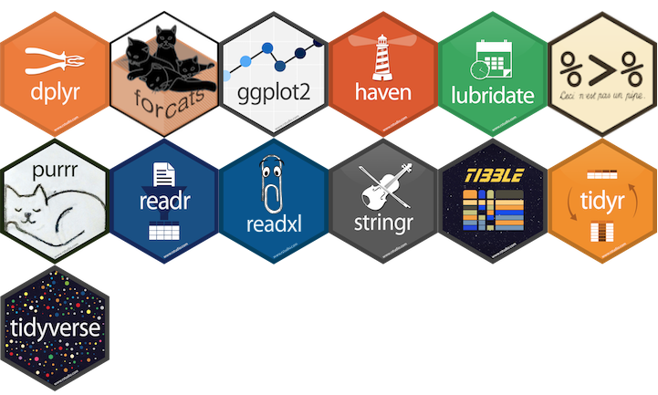

### Maria Marinho

<center></center>

- Bacharel em Matemática com Informática
- Pós Graduada em Educação Matemática
- Analista Desenvolvedora nos setores farmacêutico, bancário e outros
- Professora de Matemática
- Descobriu a paixão pelos dados
- Estuda Data Science nos MOOCs Coursera, Udacity
- Participa das comunidades PyLadies e R-Ladies São Paulo
- Transição para Ciência de Dados

mariamarinhos@gmail.com  
https://github.com/MaryMS  
https://datascienceforeverybody.tumblr.com

---

### Patrícia do Nascimento

<center></center>

- Formada em Ciências Sociais (USP)
- Cursando Estatística (USP)
- Atuou como professora de Sociologia na rede pública estadual por 3 anos
- Participa das comunidades PyLadies e R-Ladies São Paulo
- Atualmente aspirante à Cientista de Dados

pathilink@gmail.com

---

### Cronograma de hoje

- Data Science <br></br>
- Introdução ao ambiente R <br></br>
- O pacote Tidyverse <br></br>
- Desafios hands-on <br></br>
- Para aprender mais

---

### O que é Data Science?

**Data Science** ou **Ciência de Dados** é uma ciência interdisciplinar sobre o processamento de grandes conjuntos de dados usando métodos estatísticos para extrair insights sobre os dados brutos.

<center></center>

---

### Ciclo da Ciência de Dados

<center></center>

<br></br>
<br></br>
<br></br>

######Fonte: [R For Data Science](https://r4ds.had.co.nz/introduction.html)

---

class: middle

### Ciência de Dados



######Fonte: slide do Randy Lao na Conferência Data Science Go 2018

---

### Por que usar o R?

- É uma linguagem de programação para análise de dados <br></br>
- É open source <br></br>
- Possui uma comunidade ativa de desenvolvedores <br></br>
- É flexível, permitindo desenvolver funções e pacotes para facilitar o trabalho <br></br>
- Está disponível em diferentes plataformas: Windows, Linux e Mac

---

class: center, middle
# R Básico

---

### Instalação R e R Studio

Escolha a versão para o seu sistema operacional
- [Instalação do R](https://cloud.r-project.org) <br></br>
- [Instalação do R Studio](https://www.rstudio.com/products/rstudio/download/#download)

---

### RStudio

**RStudio** é o IDE da Linguagem R, ou seja, o ambiente que utilizamos para editar e executar os códigos em R.

Tem quatro áreas, conforme a figura abaixo:



---

### Help!

- Pedir ajuda: **help**(nome_da_funcao) ou **?**nome_da_funcao.

```{r, eval=FALSE}
help(sum)
?sum
```

- Se a dúvida permanecer, procure no Stack OverFlow, Google.
  - E se ainda tiver dúvidas, pergunte para a comunidade (há grupos no Telegram e outras redes sociais).

---

### Pacotes no R

**Pacotes** são coleções de funções, dados e documentação que estendem as capacidades do R básico.

Eles precisam ser instalados e carregados.

<center></center>

---

### Instalação de Pacotes:

- Via CRAN: install.packages("nome-do-pacote").

```{r, eval=FALSE}
install.packages("tidyverse")
```

- Via Github: devtools::install_github("nome-do-repo/nome-do-pacote").

```{r, eval=FALSE}
devtools::install_github("tidyverse/dplyr")
```


### Carregar pacotes:

- library(nome-do-pacote)

```{r, eval=TRUE, message=FALSE}
library(tidyverse)
```

---

### Dicas sobre Pacotes

1. Você só precisa instalar o pacote uma vez, mas precisa carregá-lo sempre que começar uma nova sessão;

2. Para instalar o pacote use as aspas;  

3. Para carregar o pacote, **não** utilize as aspas.

---

### RMarkdown

No R é possível criar documentos que podem, por exemplo, explicar os dados em textos e também apresentar os códigos e os resultados destes. Tudo em um só lugar.

**RMarkdown** é um documento que contém textos e códigos em R. 

O trecho de código do RMarkdown é chamado de **chunk**.

Atalho para criar um chunck: CTRL + ALT + I

---

### Atalhos importantes

Os atalhos facilitam. Veja os principais:<br></br>

- CTRL + ENTER: roda a linha selecionada no script.<br></br>
- ALT + **-**: (<-) sinal de atribuição.<br></br>
- CTRL + SHIFT + M: (%>%) operador pipe.<br></br>
- CTRL + ALT + I: cria um chunk do RMarkdown.

---

### R como calculadora

```{r}
2 + 5    # adição
9 - 4    # subtração
5 * 2    # multiplicação
7 / 5    # divisão
```

---

### R como calculadora

```{r}
9 %% 4   # resto da divisão de 9 por 4
7 %/% 4  # parte inteira da divisão de 4 por 3
8 ^ 2    # potenciação
sqrt(1024) # radiciação

```

A ordem matemática das operações também vale no R.

---

### Nomes de objetos e variáveis

- Os nomes devem começar com uma letra. Podem conter letras, números, _ e .<br></br>
- Recomendação do autor do livro R For Data Science: **usar_snake_case**, ou seja, palavras escritas em minúsculo separadas pelo underscore (_).<br></br>
- O R é *case sensitive*, isto é, faz a diferenciação entre as letras minúsculas e maiúsculas. Portanto, um objeto chamado *teste* é diferente de um outro objeto chamado *Teste*.


---

### Criando objetos no R

- Para atribuir um valor a um objeto no R, utilizamos o operador **<-**  <br></br>
- O atalho ALT + **-** gera o operador **<-** <br></br>
- Todas as declarações R onde são criados objetos atribuindo valores a eles, tem a mesma forma:  

<center><b>nome_do_objeto <- valor<b></center>

---

#### Exemplos de objetos e atribuição de valores

```{r}
nome_empregado <- "Tom Cruise de Souza e Silva"
nome_empregado
horas_trabalhadas <- 160
horas_trabalhadas
salario <- 3984.23
salario
ativo <- TRUE
ativo
```

---

### Classes Básicas ou Atômicas do R

- **Character**: texto <br></br>
- **Integer**: números inteiros <br></br>
- **Numeric**: números racionais <br></br>
- **Complex**: números complexos (raramente usados para Análise de Dados) <br></br>
- **Logical**: TRUE, FALSE ou NA <br></br>
- **Factor**: variavéis categóricas

---

### Tipos de objetos:

- **Vector**: armazena elementos de mesma classe. <br></br>   
- **Matrix**: vetores de duas dimensões que armazenam elementos de mesma classe. <br></br>
- **List**: tipo especial de vetor que aceita elementos de classes diferentes. <br></br>
- **Data.frame**: são tabelas de dados com linhas e colunas, como uma tabela do Excel. Como são listas, essas colunas podem ser de classes diferentes.

---

### Operadores Lógicos

- Igual a: **==** <br></br>
- Diferente de: **!=** <br></br>
- Maior que: **>** <br></br>
- Maior ou igual: **>=** <br></br>
- Menor que: **<** <br></br>
- Menor ou igual: **<=** <br></br>
- Negação: **!** <br></br>
- E: **&** <br></br>
- OU: **|** <br></br>

---

### NA

Uma característica importante do R que pode dificultar a comparação são os valores ausentes ou **NAs** (não disponíveis). 

**NA** representa um valor desconhecido. 

---

### NA

Quase qualquer operação envolvendo um valor desconhecido também será desconhecido:

```{r}
NA > 10
10 == NA
NA + 10
NA / 2
```

---

### NA

E o mais confuso:

```{r}
NA == NA
```

<br></br>

**is.na()** é a função que testa se um objeto é NA.

---

### Estrutura Condicional: IF

```{r}
mes <- "Novembro"

if(mes == "Novembro") {         
  print("O Natal é mês que vem!") # mostra essa mensagem.
}
```
---

### Estrutura Condicional: IF e ELSE

```{r}
mes <- "Dezembro"

if(mes == "Novembro") {  
  
  print("O Natal é mês que vem!") # mostra essa mensagem.
  
} else if(mes == "Dezembro") {
  
  print("O Natal chegou!") # mostra essa mensagem.
}
```

---

### Estrutura de Repetição: FOR

Imprime os 10 primeiros nomes dos personagens da base starwars usando o laço for.
```{r}
df <- starwars

lista_personagens <- head(df$name, 10)

for(i in seq_along(lista_personagens)) {
  print(lista_personagens[i])
}
```

---

class: center, middle
# Tidyverse

---

### O Tidyverse

É uma coleção de pacotes R projetados para a ciência de dados. Todos os pacotes compartilham uma mesma filosofia de desenvolvimento, sintaxe e estruturas de dados.

<center></center>

---

### Pacotes do Tidyverse

- **ggplot2**: cria gráficos <br></br>
- **dplyr**: manipulação de dados <br></br>
- **tidyr**: arruma os dados <br></br>
- **readr**: leitura dos dados <br></br>
- **purrr**: ferramentas para programação funcional, trabalha com funções e vetores <br></br>
- **tibble**: dataframes moderno, mais simples de manipular <br></br>
- **magrittr**: facilita a escrita e leitura do código <br></br>
- **stringr**: trabalha com strings <br></br>
- **forcats**: trabalha com fatores <br></br>
- **lubridate**: trabalha com datas

---

### dplyr

A ideia do pacote **dplyr** é tornar a manipulação de dados explícita utilizando verbos que indicam a ação a ser realizada. 

O encadeamento dos verbos com o banco de dados é realizado com o operador **pipe**: **%>%**

O dplyr foi desenhado para trabalhar com o operator pipe **%>%** do pacote magritrr.

---

### Os 6 verbos do dplyr 

- **filter**(): seleciona linhas <br></br>
- **arrange**(): ordena de acordo com uma ou mais colunas <br></br>
- **select**(): seleciona colunas <br></br>
- **mutate**(): cria/modifica colunas <br></br>
- **summarise**(): sumariza/agrega colunas <br></br>
- **group_by**(): agrupa colunas

---

### O operador %>%, o Pipe

Imagine uma receita que tenha as instruções: junte os ingredientes, misture e leve ao forno. Na forma usual do R, essas instruções provavelmente seriam assim:


**forno(misture(junte(ingredientes)))**


Dessa forma temos que pensar “de dentro para fora”. O primeiro comando que lemos é forno, sendo que essa é a última operação que será realizada.

Com o operador pipe seria algo assim:


**ingredientes %>% junte %>% misture %>% forno**


É mais intuitivo!
  
---

### O operador %>%, o Pipe

Para ficar mais fácil: pense no Pipe %>% como um operador que efetua as operações à direita nos valores que estão à esquerda.

Ou ainda, o operador %>%  passa o que está à esquerda como argumento para a operação da direita.

**Atalho**: CTRL + SHIFT + M

---

### Importação de arquivos

Pacote **readr**: funções para ler arquivos texto
- read_csv
- read_csv2
- read_delim
- read_log
- read_rds

Pacote **readxl**: função para ler arquivo Excel  
- read_excel

Pacote **haven**: funções para ler outros softwares estatísticos

- read_sas
- read_spss
- read_stata

---

### E lá vamos nós!

<center></center> 

---

### Importação de arquivos

```{r, message=FALSE}
library(tidyverse)

# Uma outra opção é carregar somente o(s) pacote(s) que irá utilizar.
#library(dplyr)

# Importa o arquivo csv para o objeto df_titanic
df_titanic <- read_csv("data/titanic.csv")

```

---

### View e glimpse

- Para visualizar um objeto: **View**(nome-do-objeto)

- **glimpse()**: mostra informações como o número de observações (linhas) e variáveis (colunas), o nome das colunas, o tipo delas e os primeiros dados de cada coluna.

```{r}
df_titanic %>% glimpse()
```

---

### filter

Selecionar linhas da base de dados.

```{r}
# Seleciona os sobreviventes.
df_titanic %>% filter(sobreviveu == "sim")
```

**Tibble** é uma releitura moderna do data.frame.

---

### filter

```{r, message=FALSE}
# Cria um objeto e atribui a ele as linhas com os sobreviventes.
sobreviventes <- df_titanic %>% filter(sobreviveu == "sim")


# Crianças com menos de 12 anos que sobreviveram.
criancas_sobreviventes <- df_titanic %>% filter(sobreviveu == "sim" & idade < 12)


# Embarque realizado nos locais: Southampton ou Queenstow.
embarque <- df_titanic %>% filter(embarque == "Southampton" |
                                  embarque == "Queenstow")
      
                                                                

# A instrução acima pode ser reescrita com o operador %in%:
embarque <- df_titanic %>% filter(embarque %in% c("Southampton", "Queenstow"))

```

---

### filter

```{r, message=FALSE}
# Pessoas sem informação de local de embarque.
# is.na() - função que retorna TRUE se o valor for NA e FALSE se não for.
sem_embarque <- df_titanic %>% filter(is.na(embarque))


# Pessoas que tem "Elizabeth" em qualquer posição do campo nome.
# str_detect - função que retorna TRUE se detectou o valor dado e 
# FALSE, caso não tenha encontrado.
nome <- df_titanic %>% filter(str_detect(nome, "Elizabeth"))
```

---

### Desafio 1

1) Criar um objeto chamado passageiras que seleciona somente as passageiras.

2) Criar um objeto chamado criancas_Cherbourg que seleciona as crianças com menos de 12 anos que embarcaram na cidade de Cherbourg.

---

### Desafio 1 - Resposta

1) Criar um objeto chamado passageiras que seleciona somente as passageiras.

```{r, message=FALSE}
passageiras <- df_titanic %>%  filter(sexo == "feminino")
```

2) Criar um objeto chamado criancas_Cherbourg que seleciona as crianças com menos de 12 anos que embarcaram na cidade de Cherbourg.

```{r, message=FALSE}
criancas_Cherbourg <- df_titanic %>% filter(idade < 12 & embarque == "Cherbourg")
```

---

### arrange

Ordenar as linhas da base de dados conforme uma ou mais variáveis.

```{r}
# Ordena por ordem crescente da coluna nome.
passageiros_ordenados <- df_titanic %>% arrange(nome)
passageiros_ordenados
```

---

### arrange 

É possível ordenar na ordem descrescente e também por mais de uma variável.

```{r}
# Ordena por ordem decrescente de idade e por ordem crescente de nome.
passageiros_ordenados <- df_titanic %>% arrange(desc(idade), nome)
passageiros_ordenados
```

---

### filter & arrange

```{r}
# Filtra os sobreviventes homens e ordena por classe.
df_titanic  %>% 
  filter(sexo == "masculino" & sobreviveu == "sim") %>% 
  arrange(classe)
```

---

### Desafio 2

1) Ordenar os passageiros por ordem decrescente de classe e nomeie o objeto.

2) Ordenar somente as passageiras por ordem de idade e dê um nome para o objeto.

---

### Desafio 2 - Resposta

1) Ordenar os passageiros por ordem decrescente de classe e nomeie o objeto.

```{r}
passageiros <- df_titanic %>% arrange(desc(classe))
```

2) Ordenar somente as passageiras por ordem de idade e dê um nome para o objeto.

```{r}
mulheres <- df_titanic %>% 
  filter(sexo == "feminino") %>% 
  arrange(idade)
```

---

### select

Selecionar colunas (variáveis) da base de dados.

```{r}
# Seleciona as colunas indicadas.
df_titanic %>% select(nome, idade, classe, embarque)
```

---

### select

O select tem várias funções úteis, como por exemplo:

- **starts_with**("cla"): seleciona colunas que começam com "cla" <br></br>
- **ends_with**("ifa"): seleciona colunas que terminam com "ifa" <br></br>
- **contains**("ssa"): seleciona colunas que contêm "ssa" <br></br>

---

### select

```{r}
# Seleciona as colunas que começam com "id".
df_titanic %>%  select(starts_with("id"))
```

---

### select

Ao inserir o caracter **-** na frente da coluna, você estará excluindo as colunas da seleção.

```{r}
df_titanic %>%  select(-id_passageiro, -nome)
```

---

### Desafio 3


1) Criar um objeto para salvar o resultado com as colunas nome, tarifa e classe.

2) Mostrar uma tabela com as tarifas maiores que 50 por ordem decrescente de tarifa e ordem crescente de classe. A tabela não deverá conter os campos irmaos_conjuge, pais_criancas e passagem.

---


### Desafio 3 - Resposta

1) Criar um objeto para salvar o resultado com as colunas nome, tarifa e classe.

```{r}
tarifa <- df_titanic %>% select(nome, tarifa, classe)
```


2) Mostrar uma tabela com as tarifas maiores que 50 por ordem decrescente de tarifa e ordem crescente de classe. A tabela não deverá conter os campos irmaos_conjuge, pais_criancas e passagem.

```{r}
tarifa_classe <- df_titanic %>% 
  filter(tarifa > 50) %>% 
  select(-irmaos_conjuge, -starts_with("p")) %>% 
  arrange(desc(tarifa), classe)
```

---

### mutate

Criar ou modificar colunas de uma base de dados.

Supondo que o valor da tarifa no dataset está em libras, e que 1£ = R$ 4.93, vamos descobrir qual é o valor das tarifas em reais.

```{r}
# Altera a coluna tarifa para o valor da tarifa em reais.
tarifa_conversao <- df_titanic %>% mutate(tarifa = tarifa * 4.93)


# Retorna a coluna tarifa para o valor da época.
tarifa_conversao <- df_titanic %>% mutate(tarifa = tarifa / 4.93)
```

---

### mutate

```{r}
# Cria no dataset uma nova variável chamada tarifa_reais.
tarifa_conversao <- df_titanic %>% mutate(tarifa_real = tarifa * 4.93)
tarifa_conversao
```

---

### Desafio 4

Criar uma tabela com um novo campo que contenha a tarifa em dólar seguindo essa cotação: 1£ = $ 1.31.
Classifique por ordem decrescente de tarifa.

---

### Desafio 4 - Resposta

Criar uma tabela com um novo campo que contenha a tarifa em dólar seguindo essa cotação: 1£ = $ 1.31.
Classifique por ordem decrescente de tarifa.

```{r}
tarifa_conversao <- df_titanic %>% 
  mutate(tarifa_dolar = tarifa * 1.31) %>% 
  arrange(desc(tarifa))
```

---

### summarize

Sumariza colunas da base de dados, ou seja, resume os valores das colunas em um só valor,
podendo ser a média, mediana, min, max, etc.

```{r}
# Calcula a média da variável idade
# na.rm = TRUE remove os NAs
df_titanic %>% summarize(mean(idade, na.rm=TRUE))

```

---

### summarize

```{r}
# Calcula: número de mulheres, mediana geral da tarifa e número de passageiros.
# No caso abaixo a função sum() retorna o número de mulheres. 
# A função n() mostra o número de linhas (em cada grupo) e 
# costuma ser bastante usada com o summarize.
df_titanic %>% 
  summarize(
    mulheres = sum(sexo == "feminino", na.rm = TRUE),
    mediana_tarifa = median(tarifa, na.rm = TRUE),
    num_passageiros = n()
)
```

---

### summarize

```{r}
# Filtra os passageiros homens e calcula a mediana da tarifa.
df_titanic %>% 
  filter(sexo == "masculino") %>% 
  summarize(
    mediana_tarifa = median(tarifa, na.rm = TRUE)
)
```

---

### Desafio 5

1) Calcular a média da tarifa.

2) Filtrar as passageiras mulheres e calcular a mediana da tarifa. 

---

### Desafio 5 - Resposta

1) Calcular a média da tarifa.

```{r}
media_tarifa <- df_titanic %>% summarize(mean(tarifa, na.rm=TRUE))
```

2) Filtrar as passageiras mulheres e calcular a mediana da tarifa.

```{r}
mulheres_tarifa <- df_titanic %>% 
  filter(sexo == "feminino") %>% 
  summarize(
    mediana_tarifa = median(tarifa, na.rm = TRUE)
)
```

---

### group_by + summarize

Agrupa as colunas de uma base de dados. 

O group_by é bastante utilizado com o summarize.

```{r}
# Agrupa pela variável sobreviveu e calcula
# o número de passageiros por grupo (sim/nao).
df_titanic %>% 
  group_by(sobreviveu) %>% 
  summarize(num_passageiros = n())
```

---

### group_by + summarize 
  
```{r}
# Agrupa pelo local de embarque e calcula a mediana da tarifa de cada grupo.
df_titanic %>% 
  group_by(embarque) %>% 
  summarize(mediana_tarifa = median(tarifa, na.rm = TRUE))
```

---

### Desafios 6

1) Criar uma tabela com a quantidade de pessoas por classe.

2) Criar uma tabela com a mediana da tarifa por sexo.

---

### Desafio 6 - Resposta

1) Criar uma tabela com a quantidade de pessoas por classe.
  
```{r}
df_titanic %>% 
  group_by(classe) %>% 
  summarize(qtd_classe = n())
```

---

### Desafio 6  - Resposta

2) Criar uma tabela com a mediana da tarifa por sexo.

```{r}
df_titanic %>% 
  group_by(sexo) %>% 
  summarize(mediana_tarifa = median(tarifa, na.rm = TRUE))
```

---

### Join

Com o **dplyr** também é possível fazer joins.

<center></center>

[Fonte: @yutannihilation](https://twitter.com/yutannihilation/status/551572539697143808)

---

### ggplot2 - o pacote dos gráficos


[Fonte: r-statistics.co](http://r-statistics.co/Top50-Ggplot2-Visualizations-MasterList-R-Code.html)

---

### Para aprender mais

- [Livro R for Data Science](https://r4ds.had.co.nz) <br></br>
- [Material do Curso-R](https://www.curso-r.com/material/) <br></br>
- [Site do Tidyverse](- https://www.tidyverse.org) <br></br>
- [R-Bloggers](https://www.r-bloggers.com) <br></br>

---

### Referências

- https://r4ds.had.co.nz
- https://www.curso-r.com/material/
- https://www.tidyverse.org
- http://brunaw.com/slides/rladies-sp/13-08-2018/meetup.html#1
- https://bookdown.org/wevsena/curso_r_tce/curso_r_tce.html
- https://rstudio-pubs-static.s3.amazonaws.com/279878_c7634fb5fe9e40b7abc7c35aa724a2a0.html
- https://analisereal.com/tag/introducao-a-analise-de-dados-com-o-r-2/
- http://r-statistics.co/Top50-Ggplot2-Visualizations-MasterList-R-Code.html

A apresentação foi feita em [xaringan](https://github.com/yihui/xaringan), um pacote do R! :)

---

class: middle
<center></center>

---

class: middle

### Muito obrigada!

mariamarinhos@gmail.com

<p></p>

pathilink@gmail.com
